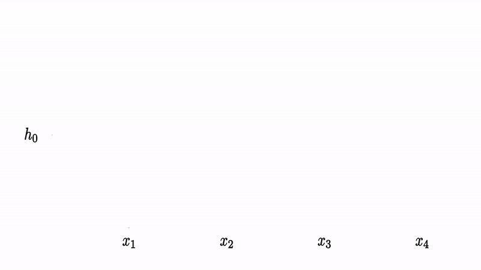
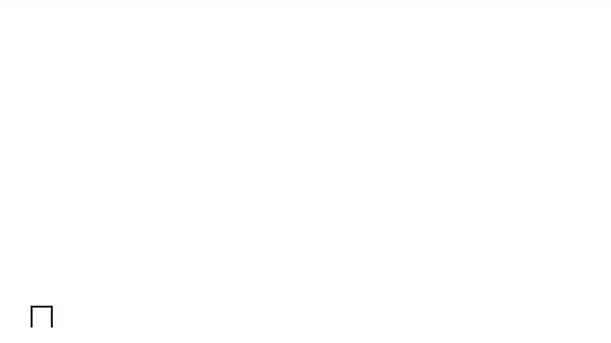

## Introduction

This repo contains code of my master thesis: *Analysis of the effectiveness of recursive
networks in the classification task*. Most of the experiments were made on Google Colab, so code used for experiments is in jupyter notebooks stored in colab folder. The implementation of ReNet networks is in ReNet folder and all models used in experiments are in Models. Below is a brief desribtion of what I've done in my thesis.

## Recurrent Neural Networks
Recurrent Neural Netowrks (RNNs) are a special type of Networks made for processing sequences. In normal neural network like MLP, we got a fixed amount of inputs and fixed amount of outputs: 

This can be very limiting when processing sequences like text, sound or any time-based signals. For that purpose the we can use RNNs. Each RNN have hidden state h. When we compute the activation for each timestep we base on the actual input and state of the network from previous timestep:

  

Later we can use h to compute .gif) estimate of some variable y, that we are interested in.

RNNs are learned with Backpropagation Through Time algorithm described [here][4].

If you want to read more about RNNs [here][5] and [here][6] are two great blog posts.

## ReNet
ReNet architecture was introduced in [this paper][1].  It's an alternative to convolutional neural networks that utilizes the recurrent neural networks. By using recurrent neural networks, we want to incorporate information scattered in the whole image while computing activations.

We can define an image as tensor:

  

where w is the image width, h is the image height and c is the number of channels.

We divide image X into patches. Patches are blocks of pixels, usually of size 2x2. Number of patches in each row and column can be determined as:

  

where w_p is patch width, and h_p is patch height. Set of all patches is given by

  

Here we can see how 2x2 patches look like for 6x6 image:

Once we got out patches, we can use them to compute activations of ReNet layer. First, we take each column of an image and feed them into a recurrent neural network. One recurrent network will from top to bottom, and second from bottom to top. This can be described as:

  

Then we concatenate each activation for forward and backward sweep and get tensor .gif). Here is how it's done:

V will be an input to next two recurrent neural networks. Analogous to the vertical sweep we compute f_HFWD, f_HREV activations, but this time we will use rows of an image. One network sweeps from left to right, second from right to left.

The result of this operation is tensor .gif). H is the output of the whole ReNet layer.

## Hilbert Curve
Hilbert Curve is a space filling curve with a fractal-like structure. It's defined by sequence of curves. Each element of this sequence is computed based on previous elements:

## Acknowledgments
All animations in this document were made using [manim][2] library made by [3blue1brown][3] creator Grant Sanderson. If you are interested in math please check out his channel. Its where I find out about Hilbert Curve in the first place.

[1]: https://arxiv.org/abs/1505.00393
[2]: https://github.com/3b1b/manim
[3]:https://www.youtube.com/channel/UCYO_jab_esuFRV4b17AJtAw
[4]:http://www.wildml.com/2015/10/recurrent-neural-networks-tutorial-part-3-backpropagation-through-time-and-vanishing-gradients/
[5]:https://colah.github.io/posts/2015-08-Understanding-LSTMs/
[6]:http://karpathy.github.io/2015/05/21/rnn-effectiveness/
